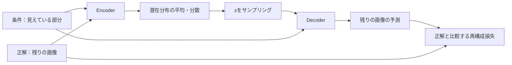

# CVAE：条件付き生成とACTでの使い方

## CVAEとは何か

**CVAE（Conditional Variational Autoencoder）は、条件を与えて、その条件に合う出力の分布を学ぶ生成モデル**。VAEがデータそのものの分布を学ぶのに対し、CVAEは「この入力が与えられたとき、どの出力があり得るか」を学ぶ。1つの入力に複数の出力が対応するone-to-many mappingを潜在変数で表現する。[出典：Sohnら§3–4](../../raw/papers/sohn_2015_cvae.pdf)

ここでは条件を $c$、生成する出力を $y$、潜在変数を $z$ と書く。原論文の入力 $x$ を $c$ に読み替えた表記である。

$$p_\theta(y\mid c)=\int p_\theta(y\mid c,z)p_\theta(z\mid c)\,dz.$$

- **条件 $c$**：生成時にも与えられる情報。
- **事前分布 $p_\theta(z\mid c)$**：正解出力を見る前の $z$ の分布。条件付きの分布を学習する構成も、条件によらない固定分布を使う構成もある。
- **decoder $p_\theta(y\mid c,z)$**：条件と潜在変数から出力の分布を決める。
- **encoder $q_\phi(z\mid c,y)$**：学習時に条件と正解出力を見て、潜在変数の事後分布を近似する。

以上は[原論文§4・Fig.1・式(4)–(5)](../../raw/papers/sohn_2015_cvae.pdf)に基づく。$z$ は条件だけでは決まらない出力のばらつきを表すための変数だが、各成分に人が解釈できる意味が自動的に割り当てられる保証はない。[解説論文§1.1](../../raw/temp/kingma_2019_introduction_to_variational_autoencoders.pdf)

## Encoderを具体例で理解する

**Encoderは、条件と正解出力を見て「この正解をDecoderで再現するには、どのあたりの潜在変数が使えそうか」を推定するニューラルネットワーク**。正解出力を予測する役割はDecoderが担い、Encoderは潜在分布のパラメータを出す。[出典：CVAE §4・Fig.1](../../raw/papers/sohn_2015_cvae.pdf)

### 入力：条件と、その条件に対応する正解

原論文のMNIST実験では、数字画像の一部を条件、残りを正解出力として使う。[出典：§5.1・Fig.3](../../raw/papers/sohn_2015_cvae.pdf)

以下はその設定を使った**説明用の仮想例**であり、図に掲載された個別サンプルや実験値ではない。見えている一部の形だけでは「3」か「5」か決めにくいとする。データに完成形が「3」の画像があれば、その学習例では、Encoderに「見えている部分」と「残りの正解である3の形」を渡す。別の学習例で完成形が「5」なら、その例の正解である5の形を渡す。1回の入力に複数の正解候補をまとめて渡すという意味ではない。[設定の出典：§5.1](../../raw/papers/sohn_2015_cvae.pdf)

### 出力：潜在変数の平均と分散

対角Gaussianを使う場合、Encoderの出力は潜在空間の平均ベクトル $\mu$ と、各次元の分散を決める値。実装では $\log\sigma^2$ を出すことが多い。これは画像の画素の平均・分散ではなく、**潜在変数 $z$ の分布の平均・分散**である。[出典：VAE §3・Appendix C](../../raw/temp/kingma_2013_auto_encoding_variational_bayes.pdf)

例えば潜在空間を2次元にした説明用の仮想モデルなら、ある学習例で次を出すと考えられる。

$$\mu=(1.0,-0.5),\qquad \sigma^2=(0.04,0.09).$$

この数字は実験値ではない。意味は「第1次元は1.0付近、第2次元は−0.5付近の $z$ を使う分布」である。標準偏差は $\sigma=(0.2,0.3)$ なので、例えば乱数 $\epsilon=(0.5,-1)$ が得られたとすると、

$$z=\mu+\sigma\odot\epsilon=(1.1,-0.8).$$

この **$z$ と条件**をDecoderへ渡し、正解の残りの画像を再構成する。Encoderの出力する平均・分散と、そこからサンプリングして得る1つの $z$ は別のもの。[計算方法の出典：VAE §2.4・3](../../raw/temp/kingma_2013_auto_encoding_variational_bayes.pdf)

図は学習時の再構成経路を示し、KL項と勾配の矢印は省略している。[構成の出典：CVAE §4・Fig.1](../../raw/papers/sohn_2015_cvae.pdf)

### やっていること：正解を再現できる潜在分布を学ぶ

Encoderに「3用の $z$ の正解」や「平均・分散の正解」を教えるわけではない。Decoderの再構成が正解からずれていたら、その誤差からDecoderとEncoderの両方を更新する。Encoderも「再構成しやすい $z$ を出せる分布」へ変わっていく。同時にKL項で事前分布から離れすぎないようにする。[出典：CVAE §3–4・式(4)–(5)、VAE §2.4](../../raw/papers/sohn_2015_cvae.pdf)・[VAE原論文](../../raw/temp/kingma_2013_auto_encoding_variational_bayes.pdf)

「3」と「5」に対応する例で異なる潜在分布を使うことは可能だが、「第1次元が数字の種類になる」と決めているわけではない。また、必ず別々の領域にきれいに分かれる保証もない。潜在表現の意味は学習結果による。[多峰性の表現：CVAE §4](../../raw/papers/sohn_2015_cvae.pdf)・[解釈可能な潜在表現の注意：VAE解説 §1.1](../../raw/temp/kingma_2019_introduction_to_variational_autoencoders.pdf)

### なぜ学習時だけ正解を見せてよいのか

学習時は正解を使って「その例を説明する $z$」を推定し、Decoderを学習できる。生成時には正解がないので、このEncoderは使わず事前分布から $z$ を選ぶ。学習時と生成時の $z$ の分布を近づけるKL項が、この2つの手順をつなぐ。ただし完全な一致や、すべての $z$ で妥当な出力が出る保証を与えるものではない。[出典：CVAE §4–4.2](../../raw/papers/sohn_2015_cvae.pdf)

### ACTに置き換えると

ACTのEncoderの入力は「現在の関節位置」と「デモに記録された将来の行動列」、出力は $z$ の平均・分散である。Decoderは「画像・現在の関節位置・サンプリングした $z$」からその行動列を再構成する。Encoderが入力する行動列は、Encoder自身が予測した未来ではなく、**学習データにある正解の未来**である。[出典：ACT §IV-B・Fig.4・Algorithm 1](../../raw/papers/zhao_2023_act.pdf)

例えば同じような開始状態から、人が少し異なる軌道で物を取ったデモがあるとする。これは説明用の仮想例。Encoderは各デモの正解軌道を見て、それをDecoderで再現するための潜在分布を出す、と考えるとよい。実際に「軌道の曲がり方」などが $z$ の特定成分になると主張するものではない。[デモのばらつきとstyle variableの出典：ACT §IV-B・Appendix C](../../raw/papers/zhao_2023_act.pdf)

実行時には正解の未来の行動列はないためEncoderを使わず、ACTでは $z=0$ をDecoderへ渡して行動列を予測する。[出典：ACT Algorithm 2・Appendix C](../../raw/papers/zhao_2023_act.pdf)

## 学習時と生成時

学習時は正解 $y$ があるので、encoderで $q_\phi(z\mid c,y)$ を求め、そこから $z$ をサンプリングし、decoderで $y$ を再構成する。生成時は正解 $y$ がないためencoderを使わず、事前分布から $z$ を選び、条件とともにdecoderへ渡す。[出典：原論文§4–4.2](../../raw/papers/sohn_2015_cvae.pdf)

最小化する損失は、条件付きELBOの符号を反転したものになる。

$$\mathcal J=-\mathbb E_{q_\phi(z\mid c,y)}[\log p_\theta(y\mid c,z)]+D_{\mathrm{KL}}\!\left(q_\phi(z\mid c,y)\Vert p_\theta(z\mid c)\right).$$

第1項は正解を説明するための再構成損失、第2項は学習時の潜在分布を生成時の事前分布に近づける項。正解を見て得た $z$ だけに依存すると、正解のない生成時との隔たりが大きくなる。この隔たりを抑える役割をKL項が担う。[出典：原論文式(4)–(5)・§4.2](../../raw/papers/sohn_2015_cvae.pdf)

Gaussian encoderでは $z=\mu+\sigma\odot\epsilon$、$\epsilon\sim\mathcal N(0,I)$ としてサンプリングし、encoderとdecoderを勾配で同時に学習する。[出典：VAE原論文§2.4・3](../../raw/temp/kingma_2013_auto_encoding_variational_bayes.pdf)

## ACTでは何が条件・出力・潜在変数になるか

| 要素 | ACTでの対応 |
| --- | --- |
| 条件 | 現在のカメラ画像と関節位置 |
| 出力 | 将来の $k$ ステップの目標関節位置（action chunk） |
| 潜在変数 $z$ | 論文では行動列のstyle variableと呼ぶ |
| CVAE encoder | 現在の関節位置と正解行動列から $z$ の平均・分散を推定。画像は入力しない |
| CVAE decoder | 画像・関節位置・$z$ から行動列を予測する方策 |
| 事前分布 | 固定の標準正規分布 $\mathcal N(0,I)$ |

表の出典：[ACT §IV-B–C・Fig.4・Appendix C](../../raw/papers/zhao_2023_act.pdf)。一般式のencoderは条件全体を使う表記だが、ACTのencoderは高速化のため条件のうち画像を省く。

**学習時**：`関節位置＋正解行動列 → CVAE encoder → 平均・分散 → zをサンプリング`、続いて `画像＋関節位置＋z → CVAE decoder → 行動列`。損失は再構成損失と重み付きKL項の和である。本文§IV-CではL1再構成損失を用いる。一方、保存版v1のAlgorithm 1にはMSEとあり、表記が一致しないため、本説明は本文に従う。[出典：ACT §IV-B–C・Algorithm 1](../../raw/papers/zhao_2023_act.pdf)

$$\mathcal J_{\mathrm{ACT}}=\mathcal L_{\mathrm{reconst}}+\beta D_{\mathrm{KL}}\!\left(q_\phi(z\mid \text{関節位置},\text{正解行動列})\Vert\mathcal N(0,I)\right).$$

**実行時**：`画像＋関節位置＋z=0 → CVAE decoder → 行動列`。CVAE encoderは使わない。したがってACTは、CVAEとしてデモのばらつきを扱って学習するが、論文の実行手順では毎回ランダムなstyleを選ばず、観測に対して決定的な出力を返す。[出典：ACT §IV-B・Algorithm 2・Appendix C](../../raw/papers/zhao_2023_act.pdf)

$z=0$ は**潜在変数の事前分布の平均**である。「平均的な行動列」を出す保証はない。decoderは非線形なので、一般に平均の $z$ に対する出力と、$z$ を変えた出力の平均は一致しない。これはACTの手順と非線形モデルからの数学的な注意であり、実験結果の主張ではない。[前提の出典：ACT Appendix C](../../raw/papers/zhao_2023_act.pdf)

また、実行時に捨てるCVAE encoderと、CVAE decoder内部のTransformer encoderは別物。画像などを処理する後者は実行時にも必要になる。[出典：ACT Fig.4・Appendix C](../../raw/papers/zhao_2023_act.pdf)

## 関連ページ

- [CVAE原論文の要約](../sources/sohn_2015_cvae.md)
- [VAEの基礎](variational_autoencoder.md)
- [ACT論文の要約](../sources/zhao_2023_act.md)
