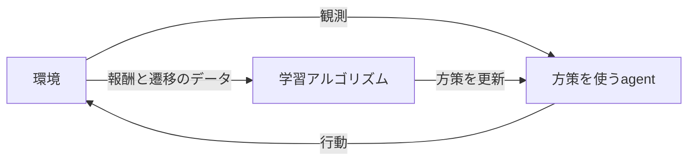

# ロボットの模倣学習と強化学習：基本的な仕組みと違い

## まず何を学ぶのか

ロボット学習で中心になるのは、**今の状況から行動を決めるルールである「方策（policy）」**を学ぶこと。模倣学習（Imitation Learning, IL）はお手本であるdemonstrationから方策を学び、強化学習（Reinforcement Learning, RL）は報酬に基づいて方策を改善する。模倣学習の代表的な方法であるBehavior Cloning（BC）なら「お手本の行動に近づける」、RLなら「将来までに得る報酬を大きくする」が学習の目的になる。[論文：Osaら §1・2](../../raw/temp/osa_2018_imitation_learning_survey.pdf)、[論文：Offline RL tutorial §2.1](../../raw/temp/levine_2020_offline_rl_tutorial.pdf)

**説明用の仮想例**として、机の上の物体を箱に入れるロボットを考える。BCでは、人が操作したときの「画像・関節情報」と「そのときの操作」を記録し、同じような状況で同じような操作を出すよう学習する。RLでは「箱に入ったら報酬」という目的を与え、物体へ近づく、つかむ、運ぶという行動を、最終的な成功に結びつくよう学習する。この例は仕組みを説明するためのもので、実験結果ではない。[仕組みの出典：Osaら §2.2・3](../../raw/temp/osa_2018_imitation_learning_survey.pdf)、[Offline RL tutorial §2.1](../../raw/temp/levine_2020_offline_rl_tutorial.pdf)

## 共通する基本用語

| 用語 | 意味 | ロボットでの説明用例 |
| --- | --- | --- |
| agent | 行動を選ぶ主体 | 学習した方策で制御するロボット |
| environment | 行動の結果として変化する対象 | ロボットの身体、物体、机などを含む環境 |
| state $s_t$ | 遷移を記述するための状態 | ロボットと物体の位置・速度など |
| observation $o_t$ | agentが取得できる情報 | カメラ画像、関節角、力センサ値など |
| action $a_t$ | 環境に対して行う操作 | 関節速度や手先の移動量などの指令 |
| policy $\pi$ | 入力から行動、または行動の確率分布を決めるもの | 画像などを入力し、次の指令を出すモデル |
| reward $r_t$ | 目的に対する評価を表す数値 | 成功時の加点、消費エネルギーへの減点など |

用語の出典：[Hugging Face：RL Framework（外部）](https://huggingface.co/learn/deep-rl-course/en/unit1/rl-framework)（[参照記録](../../raw/temp/web_huggingface_rl_framework_20261003.md)）、[論文：Offline RL tutorial §2.1](../../raw/temp/levine_2020_offline_rl_tutorial.pdf)。ロボットの例は説明用で、特定の実装仕様ではない。

stateとobservationは同じとは限らない。カメラに物体が映っていても、速度や隠れた接触状態まで分かるとは限らない。そのような部分観測の問題では、現在の画像だけでなく観測・行動の履歴を方策の入力に使うことがある。また、方策の出力を直接モータのトルクにする必要はなく、関節速度や手先の指令を出して既存のcontrollerに渡す構成もある。[Web：MIT講義ノート（外部）](https://underactuated.csail.mit.edu/imitation.html)（[参照記録](../../raw/temp/web_mit_imitation_learning_20261003.md)）、[論文：Offline RL tutorial §2.1](../../raw/temp/levine_2020_offline_rl_tutorial.pdf)

## 模倣学習とは

### お手本から行動の決め方を学ぶ

demonstrationは、expertがお手本を実行した記録。expertは人間に限らず、既存のcontrollerなどでもよい。代表的なデータは、状態または観測と行動を時系列で並べたものになる。毎回同じ軌道を再生するだけでなく、状況を入力として行動を出す方策を学ぶことが目的である。[Web：MIT講義ノート（外部）](https://underactuated.csail.mit.edu/imitation.html)（[参照記録](../../raw/temp/web_mit_imitation_learning_20261003.md)）、[論文：Osaら §1.6・2.1](../../raw/temp/osa_2018_imitation_learning_survey.pdf)

### Behavior Cloning：行動を教師信号にする

BCは、デモに含まれる観測を入力、expertの行動を正解として、教師あり学習で方策を学ぶ。概念的には、データ集合 $D=\{(o_i,a_i)\}$ に対して、予測行動とexpertの行動のずれを小さくする。連続行動を直接予測する単純な例なら、次の二乗誤差を使える。[Web：MIT講義ノート・Behavior cloning（外部）](https://underactuated.csail.mit.edu/imitation.html)（[参照記録](../../raw/temp/web_mit_imitation_learning_20261003.md)）、[論文：Osaら §3](../../raw/temp/osa_2018_imitation_learning_survey.pdf)

$$
\min_\theta\; \frac{1}{|D|}\sum_{(o_i,a_i)\in D}
\|\pi_\theta(o_i)-a_i\|^2.
$$

$\theta$ は方策モデルのパラメータ。ただし、BCの損失は二乗誤差だけではない。行動の確率分布や行動列を学ぶ構成もあり、Diffusion Policyは観測を条件とするdiffusion modelで行動列を生成する。ACTも行動列を学習する。**BCは単一のネットワーク構造や、一時刻の行動予測だけを指す名前ではない。** [論文：Osaら §3](../../raw/temp/osa_2018_imitation_learning_survey.pdf)、[Diffusion Policy §3](../../raw/temp/chi_2023_diffusion_policy.pdf)、[ACT §IV](../../raw/papers/zhao_2023_act.pdf)

### なぜお手本に合うだけでは失敗するのか

学習中に見る状況はexpertが訪れた状況だが、実行時には学習した方策自身の行動が次の状況を作る。少し操作を間違えると、デモにない状況へ移り、そこでさらに間違えることがある。この**distribution shiftと誤差の累積**のため、データ上の行動予測が正確でも、タスク全体を成功させられるとは限らない。[論文：DAgger・Introduction](../../raw/temp/ross_2011_dagger.pdf)

DAggerは、この問題に対し、学習者が訪れる状況についてexpertに適切な行動をラベル付けしてもらい、データを集約して学習し直す方法。したがって、模倣学習が必ず「最初に集めた固定データだけで完結する」わけではない。expertに追加のラベルを求められるか、という条件も重要になる。[論文：DAgger §3・Algorithm 3.1](../../raw/temp/ross_2011_dagger.pdf)

### 模倣学習はBCだけではない

Inverse Reinforcement Learning（IRL）は、デモから「どのような報酬・costを重視していたのか」を推定し、それに基づいて方策を求める。デモの行動へ直接合わせるBCとは学習対象が異なる。模倣学習の分類には複数の整理があるが、BCとIRLを区別すると、行動を学ぶ方法と目的を推定する方法の違いをつかみやすい。[Web：MIT講義ノート（外部）](https://underactuated.csail.mit.edu/imitation.html)（[参照記録](../../raw/temp/web_mit_imitation_learning_20261003.md)）、[論文：Osaら §2.2・4](../../raw/temp/osa_2018_imitation_learning_survey.pdf)

## 強化学習とは

### 行動の結果を報酬で評価する

RLでは、agentが行動し、環境が変化し、報酬と新たな観測を得る。この経験から、長期的に報酬を得られる方策を学ぶ。報酬は「この状態ではこの操作が正解」という行動ラベルではなく、結果を評価する数値なので、成功につながる行動を学習側が見つける必要がある。[Web：Hugging Face・RL Process（外部）](https://huggingface.co/learn/deep-rl-course/en/unit1/rl-framework)（[参照記録](../../raw/temp/web_huggingface_rl_framework_20261003.md)）、[論文：Koberら §2](../../raw/temp/kober_2013_robot_rl_survey.pdf)

図はオンラインRLの概念図で、毎時刻必ず方策を更新するという意味ではない。[図の根拠：Hugging Face・RL Process（外部）](https://huggingface.co/learn/deep-rl-course/en/unit1/rl-framework)（[参照記録](../../raw/temp/web_huggingface_rl_framework_20261003.md)）、[論文：Offline RL tutorial・Figure 1](../../raw/temp/levine_2020_offline_rl_tutorial.pdf)

### 目標は今すぐの報酬ではなく、将来までの報酬

有限の長さのタスクを例に、時刻 $t$ の行動後に受け取る報酬を $r_t$ と書けば、基本的な目的は次のように表せる。文献によって報酬を $r_{t+1}$ と書くこともあるが、ここでは $r_t$ に統一する。[論文：Offline RL tutorial §2.1](../../raw/temp/levine_2020_offline_rl_tutorial.pdf)

$$
J(\pi)=\mathbb{E}_{\tau\sim\pi}
\left[\sum_{t=0}^{T-1}\gamma^t r_t\right],
\qquad \max_\pi J(\pi).
$$

$\tau$ は一連の状態・行動からなるtrajectory、$T$ はその長さ、$\gamma$ は将来の報酬をどれだけ重視するかを調整するdiscount factor。$\gamma$ が1に近いほど将来の報酬の重みが大きい。期待値は、行動選択や環境の変化などのばらつきも含めて評価するためにある。[論文：Offline RL tutorial §2.1](../../raw/temp/levine_2020_offline_rl_tutorial.pdf)

説明用の箱入れタスクでは、手を物体に近づけただけでは報酬がなくても、その行動は後の成功に必要かもしれない。成功が遅れて分かる場合、過去のどの行動が寄与したかを学ぶ必要がある。これがcredit assignmentの問題である。また、成功例を得るために未知の行動を試すexplorationと、すでに良いと分かっている行動を使うexploitationの兼ね合いも生じる。[論文：Koberら §2・3](../../raw/temp/kober_2013_robot_rl_survey.pdf)

### 何を学ぶアルゴリズムなのか

RLの方法は一つではない。方策を直接改善する方法、行動後の将来の報酬を見積もる価値関数を学ぶ方法、その両方を学ぶactor-criticなどがある。$Q^\pi(s,a)$ は「状態 $s$ で行動 $a$ を取り、その後は方策 $\pi$ に従うと、どれくらいのreturnが期待できるか」を表す。Q値は即時の報酬や行動の正解ラベルとは異なる。[Web：Spinning Up・What to Learn（外部）](https://spinningup.openai.com/en/latest/spinningup/rl_intro2.html)（[参照記録](../../raw/temp/web_spinningup_rl_algorithms_20261003.md)）、[論文：Offline RL tutorial §2.1](../../raw/temp/levine_2020_offline_rl_tutorial.pdf)

model-based RLは、環境の変化などを予測するmodelを利用し、model-free RLはそのようなmodelを利用せず学習する。この「model」は環境の遷移等の予測modelを指すので、**model-freeでも方策や価値関数にニューラルネットワークを使える**。Deep RLはRLに深層ニューラルネットワークを使うもので、RLそのものが必ずDeep Learningを必要とするわけではない。[Web：Spinning Up・Model-Free vs Model-Based（外部）](https://spinningup.openai.com/en/latest/spinningup/rl_intro2.html)（[参照記録](../../raw/temp/web_spinningup_rl_algorithms_20261003.md)）、[論文：Offline RL tutorial §1](../../raw/temp/levine_2020_offline_rl_tutorial.pdf)

### 実機で学ぶとは限らない

オンラインRLは、学習中に環境から新しい経験を集める設定。環境は実機でもシミュレータでもよい。シミュレーションで学んだ方策を実機へ移すsim-to-realの例として、Leeらの四足歩行研究がある。一方、offline RLは、追加の環境との相互作用をせず、既存データから報酬に基づく方策を学ぶ。したがって「RLなら実機で毎回試行錯誤する」とは限らない。[論文：Offline RL tutorial・Figure 1・§2.2](../../raw/temp/levine_2020_offline_rl_tutorial.pdf)、[四足歩行論文・Introduction](../../raw/temp/lee_2020_quadrupedal_locomotion.pdf)

off-policyとofflineも別の区別である。off-policyは、学習対象の方策とは異なる方策で収集した経験も利用できるという性質。off-policyの方法でもオンラインで新たな経験を集めることはできる。offlineは、学習中に追加収集しないというデータ利用の設定であり、通常のoff-policy手法がそのまま固定データだけでうまく学べるとは限らない。[論文：Offline RL tutorial §1・2](../../raw/temp/levine_2020_offline_rl_tutorial.pdf)

## 両者はどう違うか

ここでは、違いが最も分かりやすい**標準的なBCと、報酬に基づくRL**を比較する。IRLやDAggerなど、模倣学習全体の性質をこの表だけで決めない。[比較の根拠：Osaら §2.2・3・4](../../raw/temp/osa_2018_imitation_learning_survey.pdf)、[Offline RL tutorial §2](../../raw/temp/levine_2020_offline_rl_tutorial.pdf)

| 観点 | 標準的なBehavior Cloning | 強化学習 |
| --- | --- | --- |
| 学習の基準 | expertの行動に合わせる | 期待累積報酬を大きくする |
| 典型的なデータ | 観測・状態とexpertの行動 | 状態・観測、行動、報酬、次の状態・観測など |
| 報酬関数 | 通常、BCの学習には不要 | 目的を表す報酬が必要。手で指定するほか、学習して与える構成もある |
| 学習中の追加収集 | 固定データだけでも学習できる | onlineでは収集し、offlineでは収集しない |
| 主な難しさ | デモの収集・品質・状況の網羅性、実行時の分布シフト | 探索、報酬設計、credit assignment、データ効率。offlineでは分布シフトも問題 |

報酬を学習して与える実機RLの具体例は、[SERL §4.2](../../raw/temp/luo_2024_serl.pdf)。デモ収集と観測の制約は[Osaら §2・5](../../raw/temp/osa_2018_imitation_learning_survey.pdf)、実機RLの制約は[Koberら §3](../../raw/temp/kober_2013_robot_rl_survey.pdf)を参照。

## 「expertとの差を報酬にしたRL」と考えられるか

**模倣の目的を報酬として表すことはできるが、通常のBCの学習と、その報酬を使う逐次的なRLの学習は区別する。** 以下はBCの損失とRLの目的関数を用いた説明上の定式化であり、独自の研究提案ではない。[定式化の根拠：Osaら §3](../../raw/temp/osa_2018_imitation_learning_survey.pdf)、[Offline RL tutorial §2.1](../../raw/temp/levine_2020_offline_rl_tutorial.pdf)

完全に状態を観測でき、各状態でexpertの行動 $\pi_E(s)$ を得られるという仮定の下で、例えば $r_E(s,a)=-\|a-\pi_E(s)\|^2$ と置ける。これを使って $\max_\pi\mathbb{E}_{\tau\sim\pi}[\sum_t\gamma^t r_E(s_t,a_t)]$ を解くなら、expertに似た行動を目的とするRLとして模倣を定式化している。これは「損失の負号を報酬にする」という数学的な対応であり、模倣学習の全手法がこの報酬を使うという意味ではない。[根拠となる定義：Osaら §2.2・3・4](../../raw/temp/osa_2018_imitation_learning_survey.pdf)、[Offline RL tutorial §2.1](../../raw/temp/levine_2020_offline_rl_tutorial.pdf)

一方、通常のBCは固定されたexpertのデータ上で、予測行動と記録された行動の損失を小さくする。入力となる状態は学習中の方策が変わっても変わらない。逐次的なRLでは、自分の行動が次の状態を変え、その後の報酬にも影響する。このため、**損失の符号を変えて「報酬」と呼ぶだけでは、学習対象の状態分布と将来の扱いが同じにならない。** [Web：MIT・Behavior cloning（外部）](https://underactuated.csail.mit.edu/imitation.html)（[参照記録](../../raw/temp/web_mit_imitation_learning_20261003.md)）、[論文：DAgger §2](../../raw/temp/ross_2011_dagger.pdf)、[Offline RL tutorial §2.1](../../raw/temp/levine_2020_offline_rl_tutorial.pdf)

また、手元にあるのがデモだけなら、自分が新しく訪れた状態でexpertが何をするかは一般に分からず、上の $r_E(s,a)$ をそのまま評価できない。追加のexpertラベルを求める方法や、デモから学んだmodelで補う方法では、それぞれ条件と推定誤差を考える必要がある。DAggerは学習者が訪れる状態へのexpertラベルを集める具体例である。[論文：DAgger §3](../../raw/temp/ross_2011_dagger.pdf)

この説明から整理すると、「模倣学習」はお手本から振る舞いを学ぶ目的・情報源の側面、「RL」は報酬に基づく逐次的な意思決定の側面として捉えられ、両者は重なり得る。BCは教師あり学習で直接方策を学ぶ代表例、IRLはデモから報酬・costを推定する代表例である。[論文：Osaら §2.2・5.1](../../raw/temp/osa_2018_imitation_learning_survey.pdf)

## ロボットでの学習の制約と組み合わせの具体例

ロボットRLでは、経験を集める時間、試行後のリセット、機体や周囲への損傷、部分観測、連続で多次元の行動などが制約になる。報酬を与えれば自動で解決するわけではなく、環境・controller・データ収集の設計も必要になる。模倣学習では人の遠隔操作などで有用な動作を示せる一方、デモ収集の負担や、デモにない状況への対応が課題になる。[論文：Koberら §3](../../raw/temp/kober_2013_robot_rl_survey.pdf)、[SERL §3・4](../../raw/temp/luo_2024_serl.pdf)、[ACT §III・IV](../../raw/papers/zhao_2023_act.pdf)、[DAgger・Introduction](../../raw/temp/ross_2011_dagger.pdf)

模倣学習とRLは組み合わせられる。デモで方策を初期化してからRLで改善する、デモをRLの経験データとして利用する、学習中に人が修正介入する、といった構成がある。ただし、**デモを使っただけではBCを実施したことにはならない**。行動を教師として合わせているのか、報酬に基づく更新のデータとして使っているのかを確認する必要がある。[論文：Osaら §1・5](../../raw/temp/osa_2018_imitation_learning_survey.pdf)、[SERL §4.1](../../raw/temp/luo_2024_serl.pdf)、[HIL-SERL・手法](../../raw/temp/luo_2024_hil_serl.pdf)

例えば、SERLはdemonstrationなどの既存データを取り込めるoff-policy RLを実機学習に用いる。HIL-SERLはdemonstrationと人間の修正介入を組み込む。四足歩行では、RLで学んだteacherの振る舞いをstudentへ蒸留する構成もある。**模倣の対象は人間の動作だけではなく、RLで学んだ方策になる場合もある。** [論文：SERL §4](../../raw/temp/luo_2024_serl.pdf)、[HIL-SERL・手法](../../raw/temp/luo_2024_hil_serl.pdf)、[四足歩行論文・Introduction / Methods](../../raw/temp/lee_2020_quadrupedal_locomotion.pdf)

## 次に読む資料

- 模倣学習の分類を読む：[Osaらのサーベイ](../../raw/temp/osa_2018_imitation_learning_survey.pdf)。
- WebでBCとロボット制御の接点を読む：[MIT・Imitation Learning（外部）](https://underactuated.csail.mit.edu/imitation.html)。講義のworking notesで、未完成の節もある。
- RLのループと基本用語を読む：[Hugging Face・RL Framework（外部）](https://huggingface.co/learn/deep-rl-course/en/unit1/rl-framework)。
- RLアルゴリズムの分類を読む：[Spinning Up・Kinds of RL Algorithms（外部）](https://spinningup.openai.com/en/latest/spinningup/rl_intro2.html)。基本分類に利用し、2018年時点の人気・性能の記述を現在の評価として扱わない。
- 実機応用へ進む：[Research候補一覧](../../raw/temp/research_robot_imitation_reinforcement_learning_20261003.md)。

Web記事の閲覧日は2026-10-03。参照記録は `raw/temp/` に保存し、本文には元記事への外部リンクを併記した。ACTは `raw/papers/` の取り込み済みPDFを参照し、その他の論文は `raw/temp/` のPDFを参照している。本ページの作成は各論文の個別要約を一括ingestするものではない。

## ACTの詳しい説明

デモから行動列を学ぶ具体例は[ACT論文の要約](../sources/zhao_2023_act.md)、行動列の実行方法は[Action ChunkingとTemporal Ensembling](action_chunking_and_temporal_ensembling.md)を参照。ACTは画像・関節位置から絶対目標関節位置の列を学習し、推論時には同じ実行時刻に対する複数の予測を統合する。[出典：ACT §IV](../../raw/papers/zhao_2023_act.pdf)
